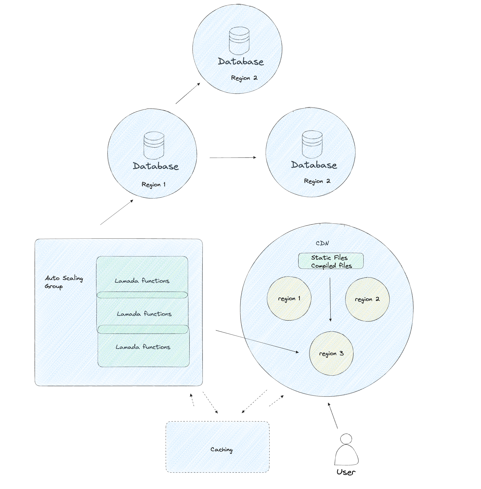

Here is what I think:

> Now that cloud providers offer whatever scale you want as long as you are okay with the cost. And I think auto scale is the future no matter what. 
> Simply put, you don't need to be worrying about this becuase your company has already paid the shit load of money to have folks taking care of it.

### Lambda service

### Edge function

Edge function is an idea from edge computing, bascially having functions/servers/DBS as close as possible to the user, in terms of distance, so that has an extreme speed. It also looks like the industry is going this way.